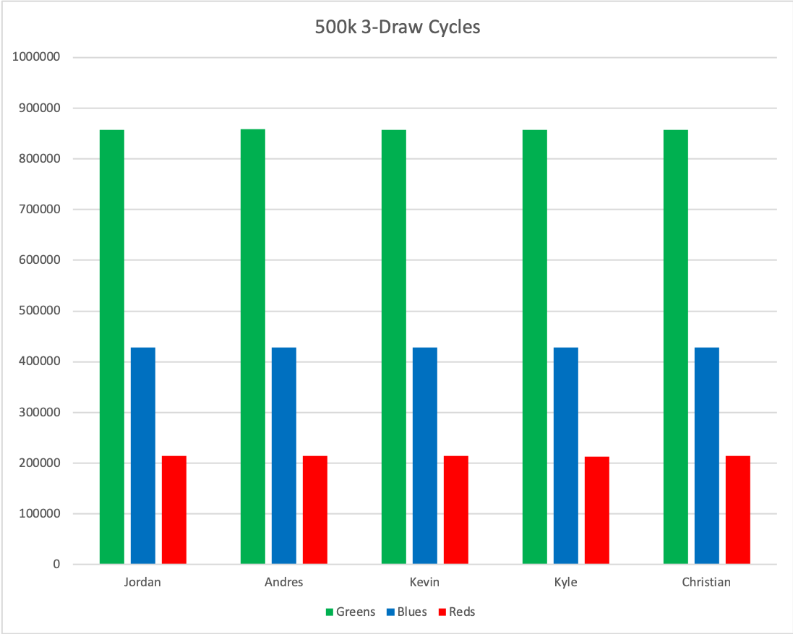

# Chipbowl

## Summary

With a standard Deadlands benny bowl, you put in 20 whites (greens for us), 10 blues, and 5 reds. Each player draws 3. Is this fair? Who gets the most reds? Let's find out!

## Hypothesis

Given a large sample size of draws, the last player will draw significantly fewer red chips than the other players. We don't define `significant` just yet, assuming it will be obviously clear in the data.

## Results



Player | Greens | Blues | Reds
-------|--------|-------|-----
Jordan | 856888 | 428303 | 214809
Andres | 858036 | 427620 | 214344
Kevin | 857089 | 428703 | 214208
Kyle | 857711 | 428772 | 213517
Christian | 857488 | 428039 | 214473
**Totals** | 4287212 | 2141437 | 1071351
**Grand Total** | 7500000

After 500,000 3-draw cycles, we can see that every player draws pretty much the same chips. Further, we see that it breaks down pretty much exactly along the lines of the distribution of the original chips: For each red drawn, the player will draw 2 blues and 4 greens.

**Hypothesis disproven!**


## Installation

`mix deps.get`

## Running

```
iex -S mix
Chipbowl.run()
```

## Output

It will ouput a `results.csv` in the `cache` directory
